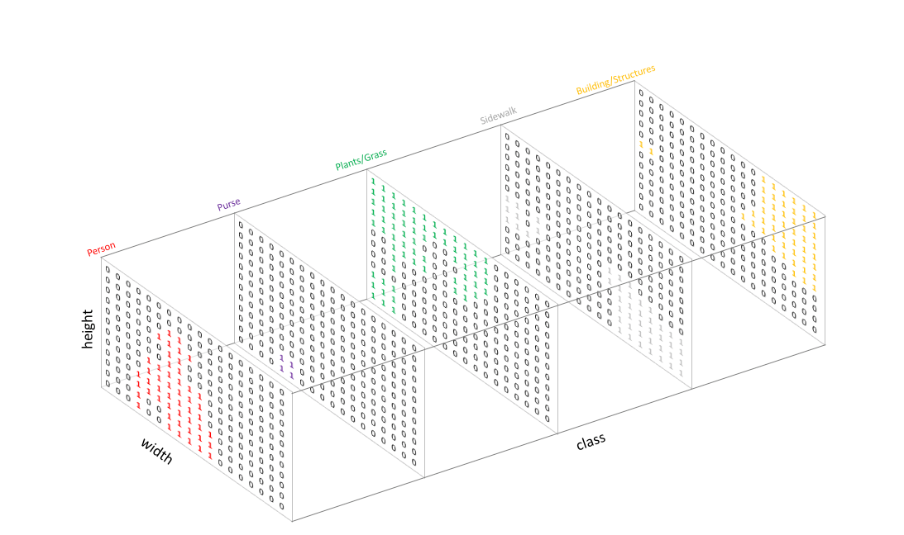

# Ceramics Shape Segmentation Network

Keras implementation of Deep Learning model to extract ceramic profile from input image. <br/>
Segmentation algorithm binarizes input image by assigning each pixel a class label of either 0 (background) or 1 (foreground).
 

## Code
One possibility is to train a U-net architecture from scratch. The code for the U-net architecture code is taken from [M. Meehan ](https://gist.github.com/margaretmeehan/f6831e5f5b071ba96eabb3dd91f38bec) and
[M. Meehan on Microsoft](https://devblogs.microsoft.com/cse/2018/07/18/semantic-segmentation-small-data-using-keras-azure-deep-learning-virtual-machine/) and is used in notebook unet_self_made.ipynb. However, it is not recommended to use this approach, because the training requires a lot of data to train all the 33M parameters of the network. <br/>
We achieved much better results by using the u-net architecture from the [segmentation_models](https://github.com/qubvel/segmentation_models) package. Here, the encoder network was pretrained on imagenet and the encoder weights were frezzed during training. Therefore, only the decoder had to be trained which drastically reduced the number of parameters to be trained. An example usage of the pretrained u-net is shown in notebook [Ceramics_Segmentation_colab.ipynb](Ceramics_Segmentation_colab.ipynb).


## Installing Anaconda environment
```
cd Shape_Segmentation <br/>
conda env create -f environment.yml
```

## Input Image data 
To train the segmentation model the image data has to converted into the following format:<br/>
- input images: (batch_size, height, width, channels) in the range [0,255] <br/>
- training images: (batch_size,height,width, classes) <br/> 

You can use the notebook [preprocess_data](preprocess_data.ipynb) to prepare the images exported by [CVAT](https://github.com/opencv/cvat). The masks in CVAT should be dumped as mask zip.

## Training data
The training can be downloaded from the the [DAI CVAT server](http://cvat.dainst.de/). You have to be in the DAI-vpn reach the server.

## Possible improvements
1. Data augmentation
2. Improve annotation quality of training data
3. Tune model hyperparameters