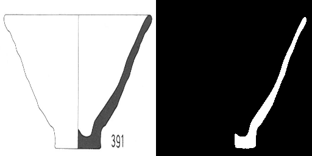

# Ceramics Shape Segmentation Network

Keras implementation of Deep Learning model to extract ceramic profile from input image. <br/>
Segmentation algorithm binarizes input image by assigning each pixel a class label of either 0 (background) or 1 (foreground).
 

## Code
We are using the u-net architecture from the [segmentation_models](https://github.com/qubvel/segmentation_models) package. Here, the encoder network was pretrained on imagenet and the encoder weights were fixed during training. Therefore, only the decoder had to be trained which drastically reduced the number of parameters to be trained. 

## Set up Docker 
See [README](../README.md).

## Input Image data 
To train the segmentation model the image data has to converted into the following format:<br/>
- input images: (batch_size, height, width, channels) in the range [0,255] <br/>
- training images: (batch_size,height,width, classes) <br/> 


## Training data
The training can be downloaded from the the [DAI CVAT server](http://cvat.dainst.de/). You have to be in the DAI-vpn reach the server. Use script [split_cvat_data](split_cvat_data.py) to split the exported data into train/test/validation sets.
The splitted and ready to use training data can be downloaded [here]()

## Trained model
You can find the model trained with ResNet34 backbone [here](https://cumulus.dainst.org/index.php/s/fXjDbfXcAXHyWTf).

## Run training and evaluation
Mount training data to docker container. Use the docker-compose.yml file for that. There are two compose files. One for GPU and one for CPU configuration. 
The training data should have the following directory structure:
* train_data
    * test
    * testannot
    * train
    * trainannot
    * val
    * valannot
For training use script [train_eval.py](train_eval.py).
```
python train_eval.py --help (see required arguments)
python train.train_eval --arg1 --arg2
```
### Data augmentation
There are two possibilities to augment the training data.
1. Create artificial training data<br/>
    Generate randomly filled vesselprofiles like the one in the image below.
    
2. Augment data by image transformations like rotation, shifting, flipping, etc.

## Possible improvements
1. Improve annotation quality of training data
2. Tune model hyperparameters